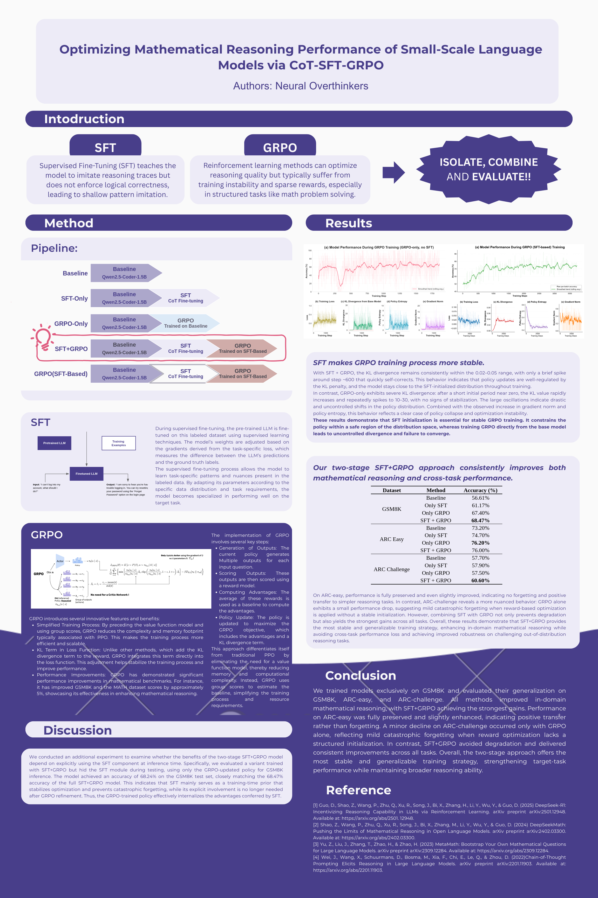

# Optimizing Mathematical Reasoning Performance of Small-Scale Language Models via CoT-SFT-GRPO

**Authors:** Neural Overthinkers

This project implements a robust two-stage training pipeline designed to enhance the mathematical reasoning capabilities of small-scale Language Models (specifically Qwen2.5-Coder-1.5B). By integrating Supervised Fine-Tuning (SFT) with Chain-of-Thought (CoT) data and Group Relative Policy Optimization (GRPO), our experiments verify that prior SFT effectively stabilizes the GRPO training process, mitigating the limitations of individual methods: the shallow pattern imitation of SFT and the training instability of pure RL.

本项目实现了一个稳健的两阶段训练流程，旨在提升小规模语言模型（特别是 Qwen2.5-Coder-1.5B）的数学推理能力。通过将基于思维链（CoT）数据的监督微调（SFT）与组相对策略优化（GRPO）相结合，我们的实验验证了先行 SFT 能有效稳定 GRPO 的训练过程，从而缓解单一方法的局限性：SFT 的浅层模式模仿问题以及纯强化学习的训练不稳定性。



*Figure — Poster: Optimizing Mathematical Reasoning Performance of Small-Scale LLMs via CoT-SFT-GRPO / 图 — 海报：通过 CoT-SFT-GRPO 优化小规模语言模型的数学推理性能*

---

## 🌟 Key Highlights / 核心亮点

### 1. Stability via SFT Initialization / SFT 初始化的稳定性
Our experiments demonstrate that **SFT initialization is essential for stable GRPO training**. It constrains the policy within a safe region of the distribution space, whereas training GRPO directly from the base model often leads to uncontrolled divergence and failure to converge.
实验表明，**SFT 初始化对于 GRPO 训练的稳定性至关重要**。它将策略约束在分布空间的“安全区域”内，而直接从 Base 模型进行 GRPO 训练往往会导致不可控的发散和收敛失败。

### 2. Superior Performance / 卓越的性能
The **SFT+GRPO** approach consistently outperforms Baseline, SFT-Only, and GRPO-Only methods.
**SFT+GRPO** 方法在性能上持续优于 Baseline、仅 SFT 和仅 GRPO 的方法。

| Dataset | Method | Accuracy (%) |
| :--- | :--- | :--- |
| **GSM8K** | Baseline | 56.61% |
| | Only SFT | 61.17% |
| | Only GRPO | 67.40% |
| | **SFT + GRPO** | **68.47%** |

### 3. Cross-Task Generalization / 跨任务泛化能力
Unlike pure RL, which can suffer from catastrophic forgetting, our two-stage approach preserves and even enhances performance on out-of-distribution tasks (ARC-Easy, ARC-Challenge).
与可能遭受“灾难性遗忘”的纯 RL 不同，我们的两阶段方法在分布外任务（ARC-Easy, ARC-Challenge）上保持甚至提升了性能。

---

## 📋 Experimental Design / 实验设计

### Ablation Study Matrix / 消融实验矩阵

| ID / 编号 | Method / 方法 | Training Script / 训练脚本 | Evaluation Script / 评估脚本 | Model Architecture / 模型架构 | Output Directory / 输出目录 | Purpose / 实验目的 |
|---|---|---|---|---|---|---|
| 0 | **Baseline** | - | `0-qwen-baseline-inference.py` | Base | `inference_results_baseline/` | Zero-shot Baseline / 零样本基线 |
| 1-2 | **SFT** | `1-qwen-cot-sft.py` | `2-qwen-cot-inference.py` | Base + SFT LoRA | `qwen_peft_sft_lora/`<br>`inference_results_sft/` | Supervised Learning Effect / 监督学习效果 |
| 3-4 | **GRPO (Base)** | `3-5-qwen-grpo-train-multigpu.py` | `4-qwen-grpo-inference.py` | Base + GRPO LoRA | `qwen_grpo_lora_multigpu/`<br>`inference_results_grpo/` | Pure RL Effect / 纯强化学习效果 |
| 5-6 | **SFT+GRPO** | `5-qwen-sft-grpo-train.py` | `6-qwen-sft-grpo-eval.py` | Base + SFT + GRPO LoRA | `qwen_sft_grpo_lora/`<br>`inference_results_sft_grpo_full/` | Joint Training Synergy / 联合训练协同效应 |
| 7 | **GRPO-only (ablation)** | - | `7-qwen-sftbased-grpo-only-eval.py` | Base + GRPO LoRA (no SFT) | `inference_results_grpo_only/` | GRPO Independent Capability / GRPO 独立能力测试 |

### Training Strategy / 训练策略说明

- **Scheme A (Scripts 3-4) / 方案 A（脚本 3-4）**: Train GRPO directly from Base model. / 从 Base 模型直接用 GRPO 训练
- **Scheme B (Scripts 5-7) / 方案 B（脚本 5-7）**: Layered LoRA / 分层 LoRA
  - Load SFT LoRA → `merge_and_unload()` → Train GRPO LoRA on new base. / 加载 SFT LoRA → `merge_and_unload()` → 在新 base 上训练 GRPO LoRA
  - **Advantage**: SFT and GRPO weights are separated, allowing independent evaluation of their contributions. / 优点：SFT 和 GRPO 权重分离，可独立评估各自贡献

---

## 🚀 Quick Start / 快速开始

### Environment Setup / 环境配置
```bash
conda activate torch-env
```

### Training Pipeline / 训练流程

#### Individual Submission / 单独提交
```bash
# 1. SFT Training / SFT 训练
sbatch 1.slurm

# 2. Evaluate SFT / 评估 SFT
sbatch 2.slurm

# 3. GRPO Training (from Base) / GRPO 训练（从 Base）
sbatch 3-5-multigpu.slurm

# 4. Evaluate GRPO / 评估 GRPO
sbatch 4.slurm

# 5. SFT+GRPO Joint Training / SFT+GRPO 联合训练
sbatch 5.slurm

# 6. Evaluate Full Model / 评估完整模型
sbatch 6.slurm

# 7. Evaluate GRPO Independent Capability (Ablation) / 评估 GRPO 独立能力（消融）
sbatch 7.slurm
```

#### Batch Submission (Auto-dependency) / 批量提交（自动等待前一步完成）

**Method 1: Using `--dependency` / 方法 1：使用 `--dependency` 参数**
```bash
JOB5=$(sbatch --parsable 5.slurm)
JOB6=$(sbatch --parsable --dependency=afterok:$JOB5 6.slurm)
JOB7=$(sbatch --parsable --dependency=afterok:$JOB5 7.slurm)
```

**Method 2: One-click Script / 方法 2：一键脚本**

# Execute / 执行
./submit_567.sh
```


## 📊 Key Metrics Tracking / 关键指标追踪

### Training Phase / 训练阶段
- **Script 5 Output / 脚本 5 输出**:
  - `reward_statistics.json` - Detailed reward statistics / 奖励函数详细统计
  - `training_history.json` - Loss and learning rate curves / Loss、学习率曲线
  - `training_summary.json` - Training configuration and final metrics / 训练配置和最终指标

### Evaluation Phase / 评估阶段
All evaluation scripts output / 所有评估脚本输出:
- `results.json` - Detailed results for each sample / 每个样本的详细结果
- `evaluation_summary.json` - Summary statistics / 汇总统计
- `error_cases.json` - Error case analysis / 错误案例分析
- `visualization_data.json` - Visualization data (for plotting) / 可视化数据（用于绘图）

---

## 🔧 Strategies for Improvement / 待改进策略

### 1. Checkpoint Management & Evaluation Strategy / Checkpoint 管理与评估策略

#### Current Strategy (Practical) / 当前策略（实用方案）

**Save during training / 训练时保存**:
```python
# Script 5 Config / 脚本 5 配置
save_strategy="steps"
save_steps=100              # Save every 100 steps / 每 100 步保存一次
save_total_limit=5          # Keep latest 5 checkpoints / 保留最新 5 个 checkpoint
```

**Load during evaluation / 评估时加载**:
- Scripts 6 & 7 automatically load the **latest checkpoint** (referencing logic from scripts 2 & 4). / 脚本 6、7 自动加载**最新的 checkpoint**（参考脚本 2、4 的逻辑）
- No hardcoded paths; intelligently finds `checkpoint-*` directories. / 不硬编码路径，智能查找 `checkpoint-*` 目录


#### Optional Deep Evaluation Schemes / 可选的深度评估方案

If the latest checkpoint results are unsatisfactory, manually evaluate others: / 如果最新 checkpoint 结果不理想，可以手动评估其他 checkpoint：

**Scheme 1: Select based on training logs / 方案 1：基于训练日志选择**
```python
# Check reward stats during training / 查看训练时的 reward 统计
reward_logs = json.load("qwen_sft_grpo_lora/reward_statistics.json")
accuracies = [log['accuracy'] for log in reward_logs]

# Find checkpoints corresponding to accuracy peaks / 找出训练时 accuracy 峰值对应的 checkpoint
peak_steps = find_peaks(accuracies)
# Manually evaluate these peak checkpoints / 手动评估这些峰值 checkpoint
```

**Scheme 2: Quick Screen + Full Eval / 方案 2：快速筛选 + 完整评估**
```bash
# Step 1: Quick screen all checkpoints with 100 samples (2 mins each) / 步骤 1：用 100 条数据快速筛选所有 checkpoint（每次 2 分钟）
for cp in checkpoint-*; do
    python eval.py --checkpoint=$cp --test_size=100
done

# Step 2: Run full test on Top 3 (3 × 3 hours) / 步骤 2：只对 Top 3 跑完整测试集（3 × 3 小时）
```

**Scheme 3: No Eval, Just Use / 方案 3：不评估，直接使用**
- With reasonable training params, the latest checkpoint is the best choice. / 训练参数合理的情况下，最新 checkpoint 就是最好的选择
- Saves 27 hours of evaluation time (90% cost). / 节省 27 小时评估时间（90% 成本）

#### Why can't GRPO automatically select the best like SFT? / 为什么 GRPO 不能像 SFT 一样自动选最佳？

**SFT (Script 1) can / SFT（脚本 1）可以**:
```python
load_best_model_at_end=True        # ✅ Auto-save best / 自动保存最佳
dataset_kwargs={"val_size": 0.1}   # ✅ Auto-split validation set / 自动划分验证集
```
- Supervised learning is simple; validation only requires calculating loss. / 监督学习简单，验证只需计算 loss

**GRPO (Scripts 3-5, 5) cannot / GRPO（脚本 3-5、5）不行**:
- RL requires generating multiple candidates (`num_generations=4-8`). / 强化学习需要生成多个候选（`num_generations=4-8`）
- Needs to run reward function for comparison. / 需要运行奖励函数对比
- TRL library's `GRPOConfig` does not support `dataset_kwargs`. / TRL 库的 `GRPOConfig` 不支持 `dataset_kwargs`
- High validation cost (each validation = running full generation pipeline). / 验证成本高（每次验证 = 跑完整生成流程）

**Conclusion**: Keep multiple checkpoints + default to latest = Balance efficiency and flexibility. / **结论**：保留多个 checkpoint + 默认使用最新 = 平衡效率和灵活性

### 2. Evaluation Strategy Enhancement / 评估策略增强
**Current Issues / 当前问题**:
- Only using greedy decoding (`temperature=0.0`). / 只用贪心解码（`temperature=0.0`）
- GRPO generates multiple candidates during training (`num_generations=4`), but only 1 during eval. / GRPO 训练时生成多个候选（`num_generations=4`），但评估时只生成 1 次

**Improvement Plan / 改进方案**:
- [ ] **Self-Consistency**: Generate 5 times and take majority vote. / 生成 5 次取多数投票答案
  - Proven effective on CoT tasks by Google paper. / Google 论文证明在 CoT 任务上有效
  - Implementation: `model.generate(..., do_sample=True, temperature=0.7, num_return_sequences=5)` / 实现：`model.generate(..., do_sample=True, temperature=0.7, num_return_sequences=5)`
  - Extract results from 5 answers and take the mode. / 对 5 个答案提取结果，取众数作为最终答案
- [ ] **Sampling Evaluation**: `temperature=0.7` to test generation diversity. / `temperature=0.7` 测试生成多样性
- [ ] **Beam Search**: `num_beams=3` to compare with greedy decoding. / `num_beams=3` 对比贪心解码

**Note**: Multiple generations during GRPO training are for reward comparison; evaluation can use different strategies. / **注意**：GRPO 训练时的多次生成是为了计算奖励对比，评估时可以用不同策略。

### 3. Reward Function Optimization / 奖励函数优化
**Current Issues / 当前问题**:
- Binary reward (0/1) is a sparse signal. / 二值奖励（0/1）稀疏信号
- No format reward (cannot distinguish format error vs answer error). / 无格式奖励（格式错误和答案错误无法区分）

**Improvement Plan / 改进方案**:
- [ ] **Tiered Rewards / 分层奖励**:
  ```python
  if format_correct:
      if answer_correct: reward = 1.0
      else: reward = 0.3  # Format correct but answer wrong / 格式对但答案错
  else:
      reward = 0.0  # Format wrong / 格式错
  ```
- [ ] **Partial Correctness Reward / 部分正确奖励**: Order of magnitude correct gets 0.5. / 数量级正确给 0.5


### 5. Validation Set Evaluation / 验证集评估
**Current Missing / 当前缺失**:
- No evaluation on validation set during training. / 训练时没有在验证集上评估
- Cannot monitor overfitting. / 无法监控过拟合

**Improvement Plan / 改进方案**:
- [ ] Evaluate accuracy on validation set (50 samples) every N steps. / 每 N 步在验证集（50 条）上评估准确率
- [ ] Record validation curve for Early Stopping. / 记录验证曲线用于 Early Stopping
- [ ] Compare training/validation accuracy to monitor generalization. / 对比训练集/验证集准确率监控泛化

### 6. Deep Error Analysis / 错误分析深化
**Current Analysis / 当前分析**:
- Only split into "Format Error" and "Total Error". / 只分了"格式错误"和"总错误"

**Improvement Plan / 改进方案**:
- [ ] **Problem Type Classification**: Percentage, Fraction, Geometry, Multi-step reasoning, etc. / **问题类型分类**：百分比、分数、几何、多步推理等
- [ ] **Error Pattern Recognition**: Calculation error, Understanding error, Unit conversion error. / **错误模式识别**：计算错误、理解错误、单位转换错误
- [ ] **Visualize Error Distribution**: Group by problem length, complexity. / **可视化错误分布**：按问题长度、复杂度分组

---

